# Análise de Exportações Globais

Autor: Augusto César da Silva Carvalho

## Visão Geral

Este projeto realiza uma análise exploratória e multivariada das exportações globais entre 2023 e o inicio de 2025, com foco na identificação de padrões de especialização produtiva, concentração setorial e similaridade entre países. Para isso, utiliza dados de comércio internacional organizados por categorias do Sistema Harmonizado (HS) e aplica técnicas de pré-processamento, redução de dimensionalidade e visualização.

---

## 1. Descrição do Dataset

O dataset utilizado contém informações de exportações globais, estruturadas a partir de bases de comércio internacional (ex.: BACI/CEPII), com variáveis principais como:

* **i**: país exportador
* **j**: país importador
* **k**: código do produto (HS)
* **v**: valor monetário exportado
* **q**: quantidade exportada
* **t**: ano da observação

Os dados são originalmente apresentados em formato transacional (fluxos bilaterais) e foram reorganizados para permitir análises agregadas por país e por categoria de produto.

Os dados foram coletados a partir do site [CEPII-BACI](https://www.cepii.fr/CEPII/en/bdd_modele/bdd_modele_item.asp?id=37).

---

## 2. Pré-processamento dos Dados

As principais etapas de pré-processamento incluem:

* **Filtragem temporal**, selecionando anos específicos de interesse
* **Agregação dos fluxos comerciais**, somando exportações por país e categoria de produto
* **Construção de matrizes país × produto**, a partir de operações de `groupby` e `pivot`
* **Normalização das exportações**, transformando valores absolutos em participações relativas (share das exportações por país)
* **Tratamento de valores ausentes**, com preenchimento por zero após agregações

Esse processo permite comparar países independentemente de sua escala absoluta de comércio.

---

## 3. Organização por Categorias e Classificações

A análise é conduzida em diferentes esquemas de agregação, permitindo múltiplas leituras do perfil exportador:

### 3.1 Sistema Harmonizado (HS)

* HS2 (2 dígitos): visão setorial ampla, adequada para análises estruturais
* Possibilidade de extensão para níveis mais detalhados (HS4)

A agregação por HS2 facilita a interpretação econômica e a visualização de padrões gerais no comércio internacional.

### 3.2 Classificação BEC (BEC1)

Além do Sistema Harmonizado, o projeto também utiliza a classificação BEC (Broad Economic Categories) em seu nível mais agregado (BEC1), que organiza os produtos segundo seu uso econômico:

* Alimentos e bebidas
* Insumos industriais
* Combustíveis e Lubrificantes
* Bens de capital
* Equipamento de transporte
* Bens de consumo
* Bens não especificados

Essa classificação permite analisar o comércio internacional sob a ótica da função econômica dos bens, complementando a análise setorial do HS e oferecendo insights sobre a posição dos países nas cadeias produtivas globais.

---

## 4. Métodos e Algoritmos Aplicados

Nesta etapa, o objetivo é identificar similaridades estruturais entre países a partir da composição de suas exportações. Como o espaço original (país × categoria de produto) é altamente dimensional, são aplicadas técnicas de redução de dimensionalidade e análise exploratória visual.

### 4.1 PCA – Principal Component Analysis

O PCA é utilizado como técnica inicial de redução linear de dimensionalidade, servindo como uma referência para entender a estrutura global dos dados.

* Reduz o espaço original para componentes ortogonais
* Maximiza a variância explicada
* Permite identificar países com estruturas exportadoras semelhantes em termos médios

A projeção em duas dimensões possibilita observar a separação entre países mais diversificados e aqueles fortemente especializados. Porém para esta análise ele não serviu bem, pois não há uma visualização agradável de clusterização.

#### HS2 - PCA

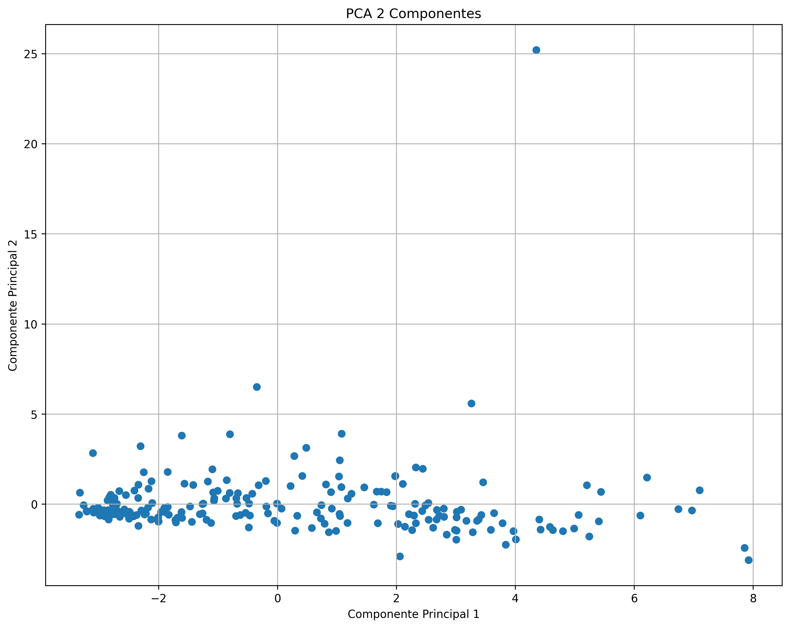

#### BEC1 - PCA

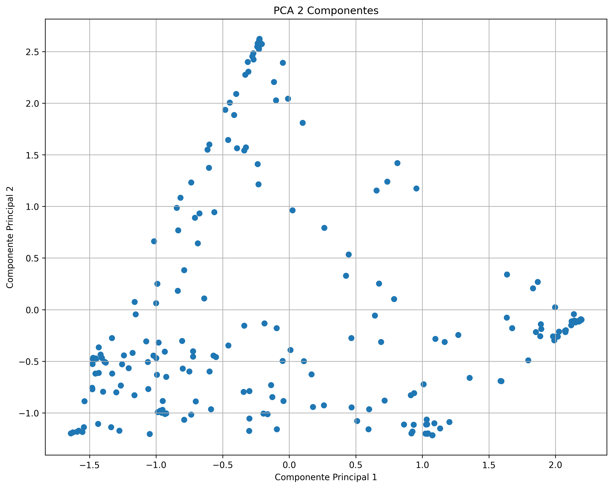

---

### 4.2 t-SNE – t-distributed Stochastic Neighbor Embedding

O t-SNE é uma técnica não linear focada na preservação de vizinhanças locais. Seu uso é especialmente adequado para:

* Evidenciar agrupamentos latentes
* Destacar similaridades locais entre países
* Revelar estruturas que não aparecem em métodos lineares

Diferentemente do PCA, o t-SNE não preserva distâncias globais, mas é eficaz para identificar clusters visuais associados a perfis exportadores semelhantes. Inclusive serviu para visualizar clusters na divisão de produtos pela BEC1.

#### HS2 - t-SNE

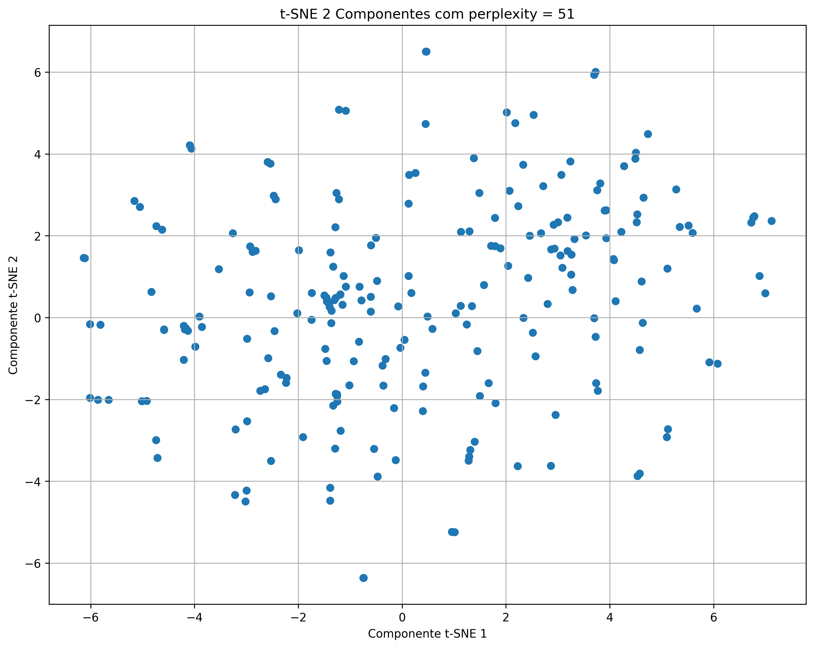

#### BEC1 - t-SNE

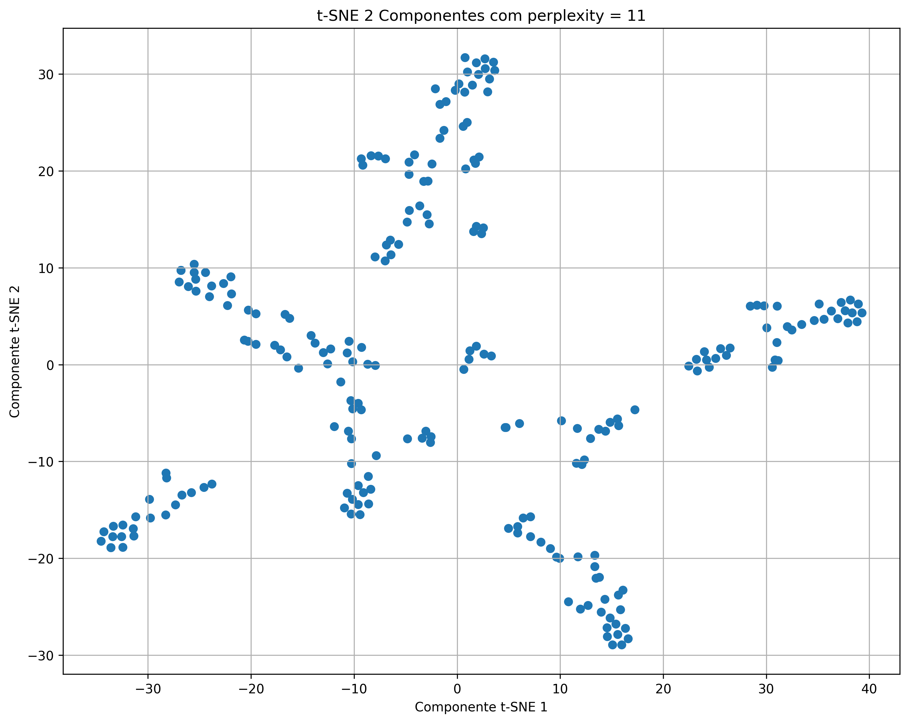

---

### 4.3 UMAP – Uniform Manifold Approximation and Projection

O UMAP é a principal técnica de projeção utilizada neste trabalho, por combinar:

* Preservação de estruturas locais
* Melhor representação da estrutura global
* Maior estabilidade em relação ao t-SNE

O UMAP permite visualizar de forma mais contínua a transição entre diferentes perfis produtivos. Para a classificação BEC1 foi possível observar clusters bem definidos, já para o HS2 não houve tanta clusterização visual. De qualquer forma serão estas visualizações que serão utilizadas ao longo da análise.

#### HS2 - UMAP

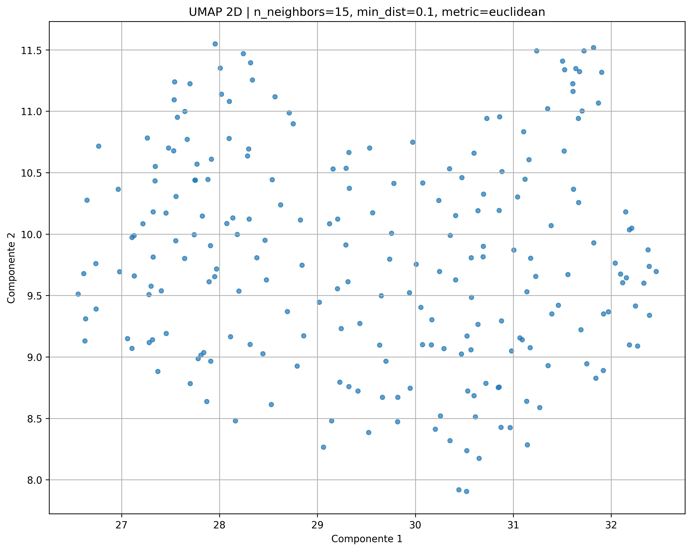

#### BEC1 - UMAP

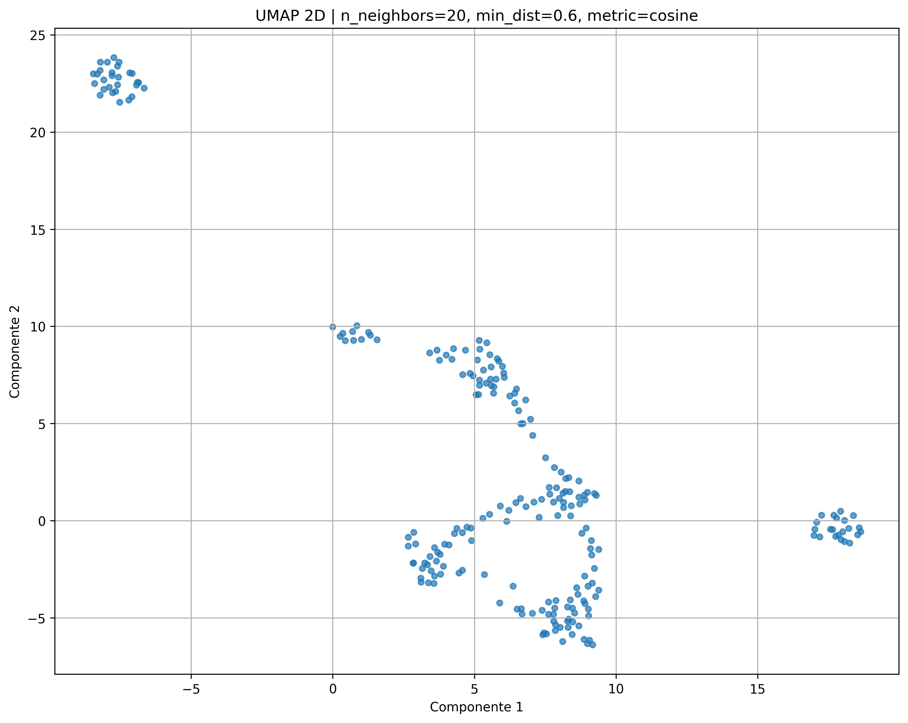

---

## 5. Resultados e Análise Visual

### 5.1 Análise com Classificação HS2

Utilizando a agregação HS2, observa-se que os países se organizam de acordo com grandes setores produtivos, como:

* Exportadores de commodities
* Economias industriais diversificadas
* Países especializados em manufaturas específicas

As projeções evidenciam que países com cestas exportadoras semelhantes tendem a ocupar regiões próximas no espaço reduzido.

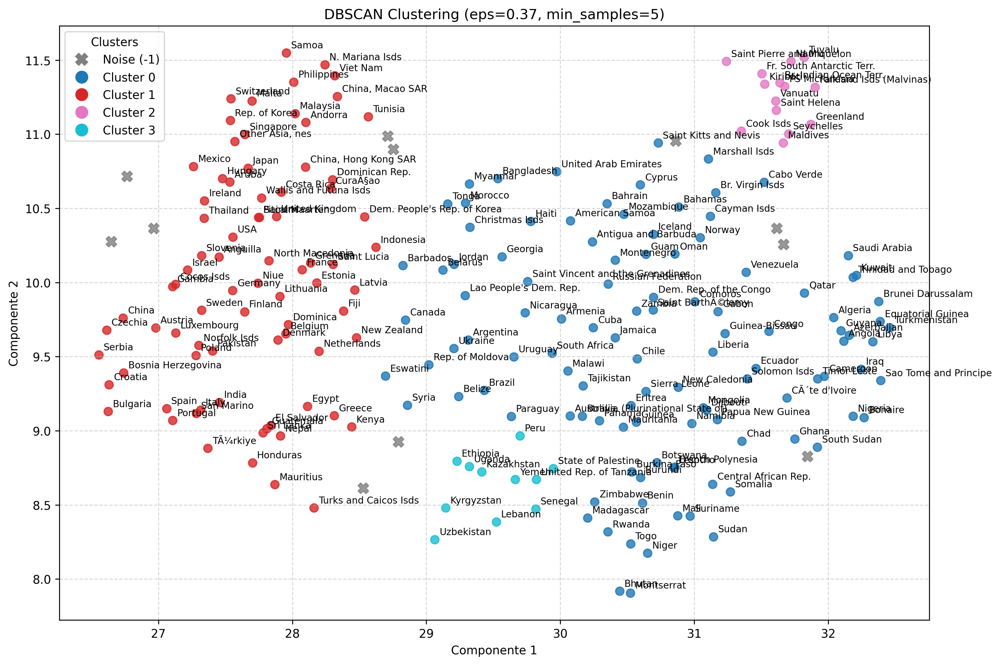

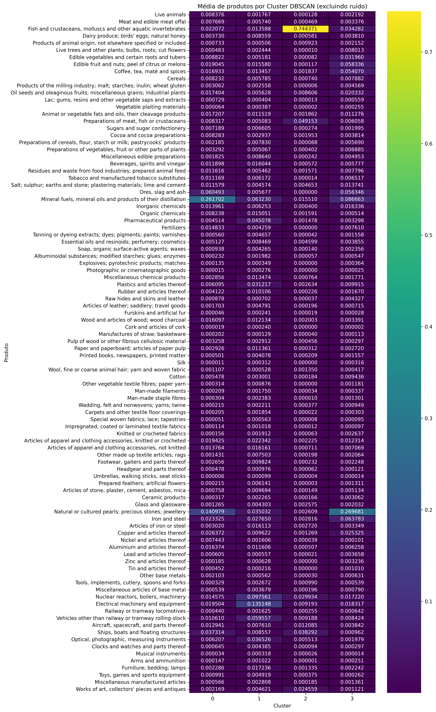

---

### 5.2 Análise com Classificação BEC1

Ao utilizar a classificação BEC1, a análise passa a refletir o uso econômico dos bens exportados, permitindo interpretações mais diretamente ligadas às cadeias produtivas globais.

Os resultados mostram:

* Países concentrados em bens intermediários, geralmente associados a cadeias industriais
* Economias voltadas para bens de consumo, com maior proximidade entre si
* Países exportadores de bens de capital, formando agrupamentos específicos

Essa abordagem complementa a análise HS ao deslocar o foco do setor para a função econômica do bem.

#### Utilizando UMAP + k-Means

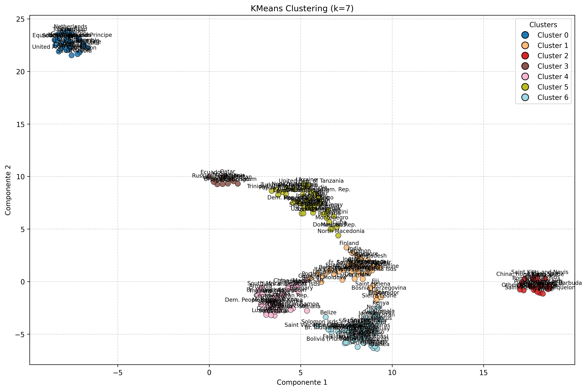

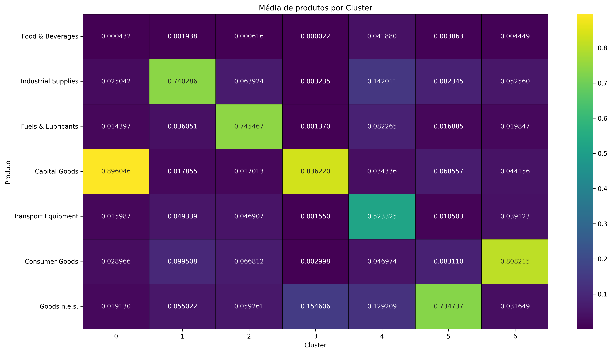

#### Utilizando t-SNE + DBSCAN

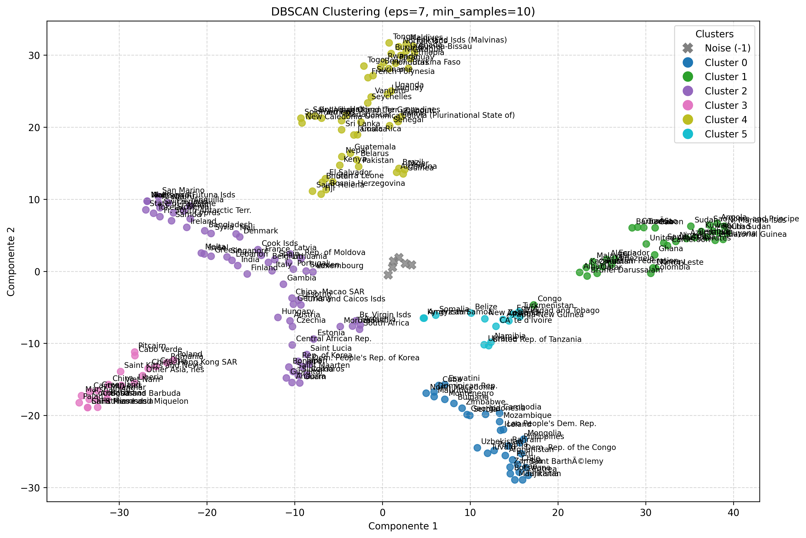

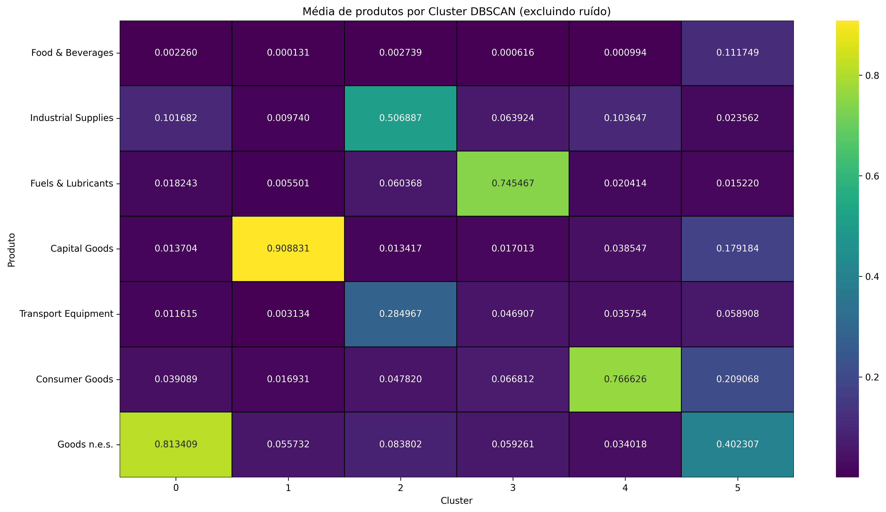

---

## 6. Interpretação Econômica dos Resultados

Esta seção aprofunda a leitura econômica das projeções e visualizações obtidas, com foco especial nos países de maior relevância no comércio internacional, conforme destacado nos plots apresentados no notebook.

---

### 6.1 Análise Focada nos Principais Países Exportadores

Ao destacar explicitamente os principais países exportadores nos plots, grandes economias desenvolvidas e emergentes, observa-se que:

* Países desenvolvidos tendem a se agrupar em clusters iguais
* Economias emergentes apresentam maior dispersão, refletindo trajetórias distintas de industrialização
* Países com forte base industrial se aproximam no espaço projetado, mesmo quando geograficamente distantes

Essa proximidade reforça a ideia de que a estrutura produtiva é mais determinante do que a localização geográfica.

---

#### 6.1.1 Interpretação pela Classificação HS2

Quando a análise é conduzida com base na classificação HS2, os agrupamentos refletem similaridades setoriais amplas:

* Exportadores de commodities primárias formam clusters distintos
* Países com base manufatureira diversificada tendem a se agrupar
* Setores intensivos em tecnologia aparecem associados a economias mais complexas

Essa leitura é particularmente útil para identificar especializações produtivas dominantes.

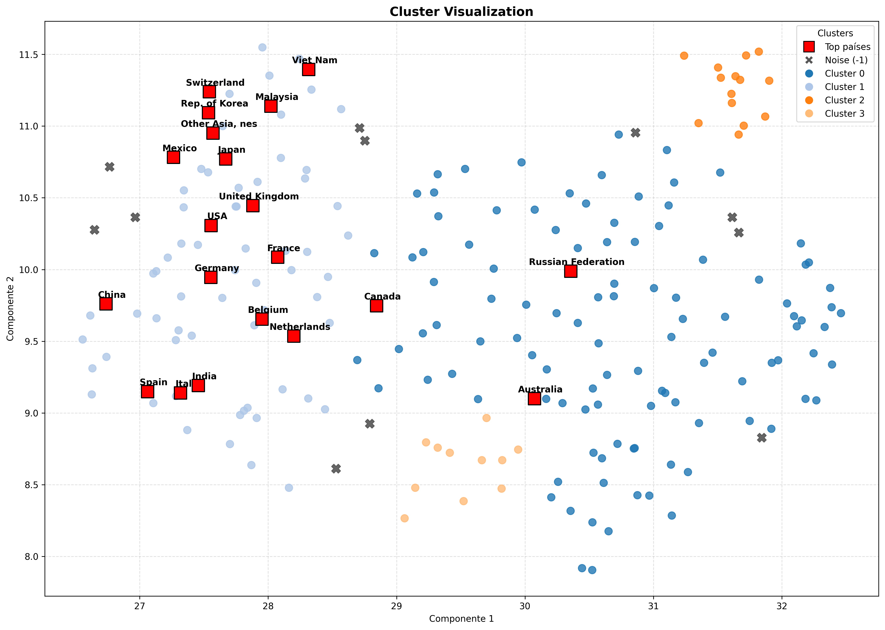

---

#### 6.1.2 Interpretação pela Classificação BEC1

A utilização da classificação BEC1 permite uma leitura complementar, focada no uso econômico dos bens exportados.

Os plots indicam que:

* Países concentrados em bens intermediários tendem a ocupar posições de transição
* Economias focadas em bens de consumo formam agrupamentos mais compactos
* Exportadores de bens de capital aparecem próximos ao núcleo central

Essa abordagem evidencia a posição funcional dos países nas cadeias globais de produção.

---

### 6.2 Robustez dos Padrões entre Métodos

A comparação entre PCA, t-SNE e UMAP mostra que, apesar das diferenças metodológicas:

* Os principais agrupamentos se repetem
* Países centrais permanecem centrais
* Países especializados permanecem periféricos

Isso sugere que os padrões identificados não são artefatos de um método específico, mas refletem estruturas reais dos dados.

---

## 7. Síntese Analítica

De forma sintética, os resultados indicam que:

* A diversidade exportadora é um fator-chave de centralidade
* A especialização extrema está associada à periferia do espaço projetado
* Diferentes classificações (HS2 e BEC1) capturam dimensões complementares da estrutura produtiva
* As visualizações permitem identificar padrões que não seriam evidentes em análises univariadas

---

## 7. Tecnologias Utilizadas

* **Python**
* **Pandas / NumPy** – manipulação e agregação de dados
* **Scikit-learn** – PCA, t-SNE e normalizações
* **UMAP-learn** – projeções não lineares
* **Matplotlib / Seaborn** – geração de gráficos
* **Jupyter Notebook** – ambiente de desenvolvimento

---

## 8. Conclusões e Próximos Passos

Este trabalho demonstrou como técnicas de redução de dimensionalidade aplicadas a dados de comércio internacional permitem revelar padrões estruturais relevantes entre países.

Como extensões futuras, destacam-se:

* Aplicação de outras formas de clusterização e redução de dimensionalidade para validação dos agrupamentos visuais
* Análise temporal da evolução dos perfis exportadores
* Integração com indicadores de complexidade econômica
* Exploração de níveis mais detalhados do Sistema Harmonizado e do BEC, como o HS4, BEC2, BEC3.
